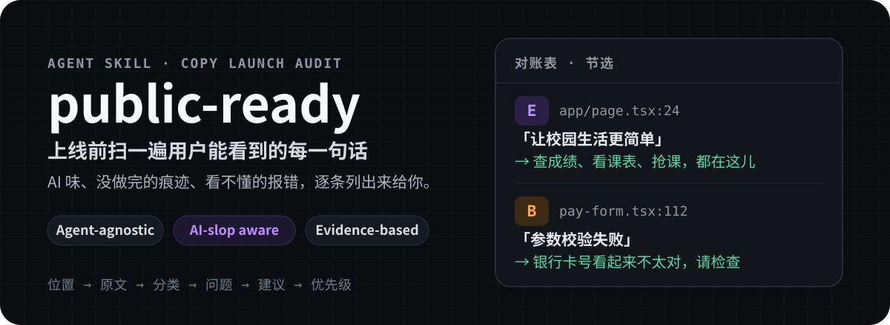
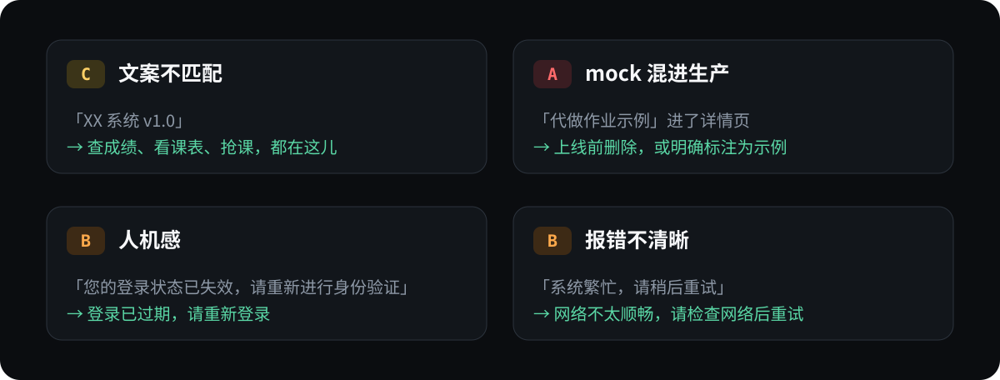
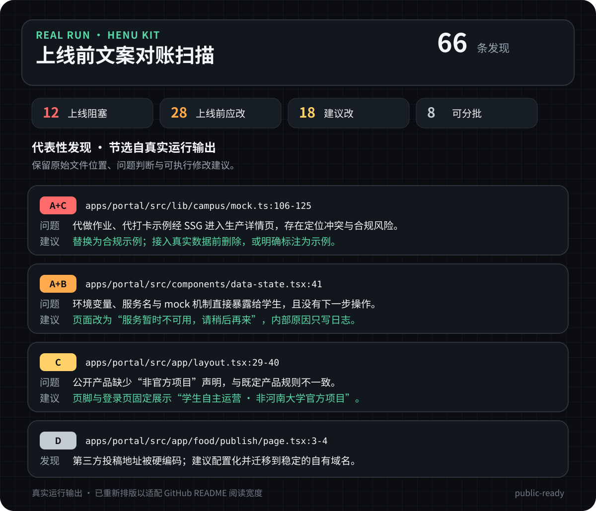
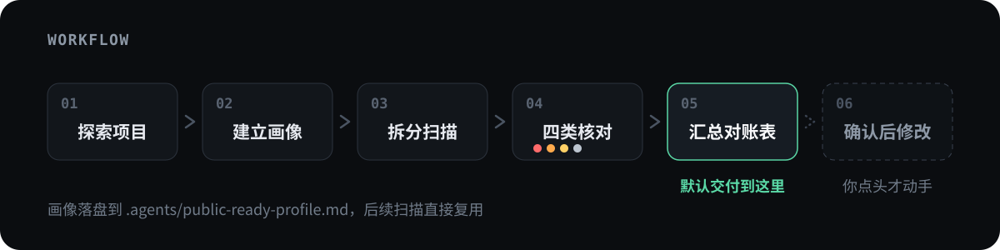

<p align="center">
  
</p>

<p align="center">
  
  
</p>

<p align="center">
  <a href="#它在找什么">它在找什么</a> ·
  <a href="#真实运行结果">真实结果</a> ·
  <a href="#这是什么">这是什么</a> ·
  <a href="#工作流程">工作流程</a> ·
  <a href="#快速使用">快速使用</a>
</p>

---

## 它在找什么

代码跑通了，不代表这个页面见得了人。最常见的是这四种：

<p align="center">
  
</p>

- **文案不匹配** —— 页面说的和产品实际是什么对不上。首页只报一个系统名和版本号，用户不知道能拿它干嘛；或者正式平台突然开始卖萌。
- **mock 混进生产** —— 演示用的假数据没清干净，跟着 SSG、store 初始值、fallback 一路渲染到线上。有环境开关也不保险，得追数据流。
- **人机感** —— 「您的登录状态已失效，请重新进行身份验证」。没错，但没人这么说话。公文腔、被动语态、技术词直出，读起来就是程序员写给程序员看的。
- **报错不清晰** —— 「系统繁忙，请稍后重试」既不说发生了什么，也不说用户能做什么。后端的原始报错直接透传给用户，更糟。

## 真实运行结果

<p align="center">
  
</p>

这是 `public-ready` 对 **HENU Kit** 的一次真实扫描，覆盖 Portal、Console、旧学习平台、QuizCraft 以及后端透传的错误文案，同类合并后共 66 条发现、12 条上线阻塞。

上图四条是节选：生产示例数据的合规风险、面向学生暴露内部配置、产品声明缺失，以及第三方地址硬编码。它们代表这个 Skill 实际在做的事 —— 理解产品背景、追踪真实渲染路径、给出文件级证据、附上能直接执行的改法。

> 图片按 README 阅读宽度重新排版，内容来自实际运行输出；完整结果仍以 Markdown 对账表交付。

## 这是什么

一个面向网站和 Web 应用的发布前文案审计 Skill。它先弄清产品定位、目标用户和语气基准，再扫描最终渲染到界面上的文本，找出不适合上线的部分。

产出是一张对账表，每条发现六个字段，缺一不可：

| 位置 | 原文 | 分类 | 问题 | 建议 | 优先级 |
| --- | --- | --- | --- | --- | --- |
| `src/pages/Login.tsx:88` | `token 已过期` | B | 暴露内部术语，用户不知道下一步做什么 | 改为「登录已过期，请重新登录」 | 🟠 上线前应改 |

默认到此为止 —— 表交给你，改不改、怎么改你说了算。

适用于 Claude Code、Codex、Cursor、Hermes、Trae 等能读取 Agent Skill 的工具，不绑定特定 Agent 实现。

<details>
<summary>分类与优先级对照</summary>

<br>

上面四类痛点在对账表里对应这些代号：

| 分类 | 对应痛点 | 覆盖范围 |
| --- | --- | --- |
| 🔴 **A** | mock 混进生产 | 未完成内容、占位、调试残留、内部信息泄露 |
| 🟠 **B** | 人机感 / 报错不清晰 | 技术词外露、公文腔、模糊或甩锅式提示 |
| 🟡 **C** | 文案不匹配 | 语气、称呼、定位和价值主张与产品初衷矛盾 |
| ⚪ **D** | —— | 硬编码：应配置化、复用或进入 i18n 的文本 |

同一问题可以组合分类，例如 `A+D`：既阻塞上线，也属于硬编码。

优先级四级：🔴 上线阻塞（不修不应发布）、🟠 上线前应改（影响用户理解或操作）、🟡 建议改（影响一致性和体验）、⚪ 可分批（配置化与长期维护）。

</details>

## 工作流程

<p align="center">
  
</p>

### 扫描范围

- 页面和组件中的文本节点、按钮、标题、占位符、`aria-label` 与 `alt`
- toast、空状态、错误页和用户可见报错
- i18n / locale / messages 等语言文件
- 可能透传到前端的后端错误信息
- 路由、菜单、页脚、联系方式、版本号等配置文本
- 可能被渲染为真实内容的 mock 或静态示例数据

基础设施日志、测试断言和仅开发者可见的内部代码，不会因为关键词命中就被误判为用户文案。

## 快速使用

### 1. 安装

**Claude Code（全局可用）**

```bash
git clone https://github.com/jry21223/public-ready.git ~/.claude/skills/public-ready
```

**Claude Code（只在当前项目可用）**

```bash
git clone https://github.com/jry21223/public-ready.git .claude/skills/public-ready
```

**其他 Agent**：把下面两个文件直接交给它读取。

```text
https://raw.githubusercontent.com/jry21223/public-ready/main/SKILL.md
https://raw.githubusercontent.com/jry21223/public-ready/main/references/stiff-copy-patterns.md
```

### 2. 用自然语言发起审计

```text
帮我检查这个项目的用户可见文案是否适合上线。
先建立产品画像，再按 public-ready 的规则输出对账表，不要直接修改代码。
```

不需要记住专业术语。下面这些表达也会触发审计：

<details>
<summary>查看常见触发方式</summary>

<br>

- 「帮我做一下发布前准备」
- 「这个页面能上线吗？」
- 「文案读起来像程序员写的」
- 「检查一下提示语和报错信息」
- 「看看有没有占位、测试数据或写死的内容」

</details>

## 审计原则

1. **只看用户可见内容**：grep 命中只是线索，不等于问题。测试、构建配置和内部日志不算发现。
2. **报错必须可行动**：至少说清发生了什么，以及用户下一步能做什么。后端透传的原始错误不直出给用户。
3. **语气以画像为准**：判断「和产品初衷不符」必须有依据，不靠感觉。画像会先给你确认再落盘。
4. **并行扫描、集中汇总**：按模块分给 subagent，主 Agent 只负责定范围和最终判断，避免大量文案挤进同一个上下文影响分类。

## 目录结构

```text
public-ready/
├── README.md
├── SKILL.md
├── LICENSE
├── assets/
│   └── readme/
│       ├── hero.svg
│       ├── pain-points.svg
│       ├── henu-kit-audit-example.svg
│       └── workflow.svg
└── references/
    └── stiff-copy-patterns.md
```

- [`SKILL.md`](./SKILL.md)：完整工作流、分类规则、subagent 机制和自查清单
- [`references/stiff-copy-patterns.md`](./references/stiff-copy-patterns.md)：关键词线索、典型问题与改写方向

## License

[MIT](./LICENSE) © jry21223
